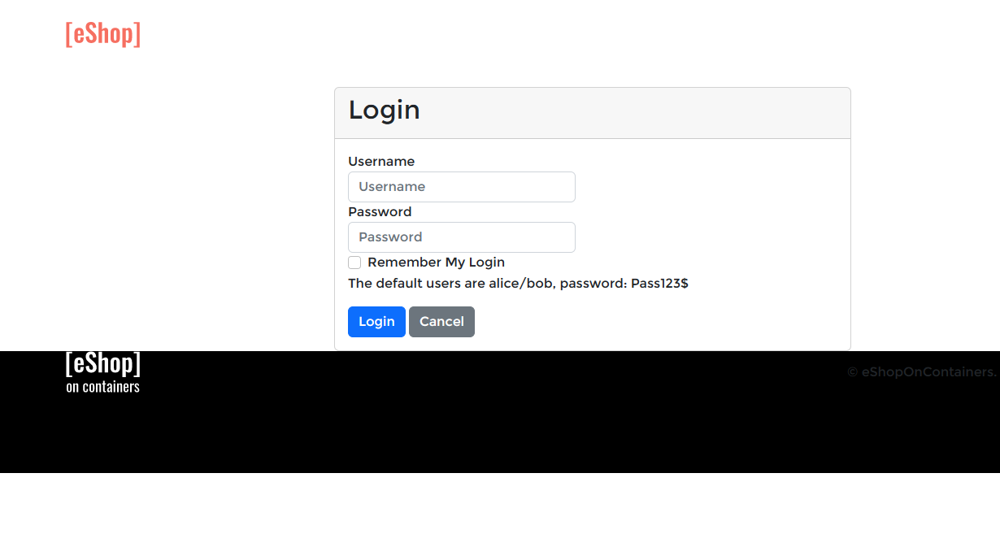

This page covers the exploration of the eShopOnContainers application and assumes you've already:

- Setup your development system for [Windows](Windows-setup) or [Mac](Mac-setup), at least up to the point of running eShopOnContainers from the CLI.

> **CONTENT**

- [MVC Web app](#mvc-web-app)
  - [Authenticating and creating an order on the Web MVC app](#authenticating-and-creating-an-order-on-the-web-mvc-app)
- [SPA Web app](#spa-web-app)
- [Swagger UI - REST API microservices - Catalog](#swagger-ui---rest-api-microservices---catalog)
- [Xamarin.Forms mobile apps for Android, iOS and Windows](#xamarinforms-mobile-apps-for-android-ios-and-windows)
- [All applications and microservices](#all-applications-and-microservices)

## MVC Web app

Open a browser and type <http://host.docker.internal:5100> and hit enter.
You should see the MVC application like in the following screenshot:

### Authenticating and creating an order on the Web MVC app

When you try the Web MVC application by using the url <http://host.docker.internal:5100>, you'll be able to test the home page which is also the catalog page. But if you want to add articles to the basket you need to login first at the login page which is handled by the STS microservice/container (Security Token Service). At this point, you could register your own user/customer or you can also use one of the default users/customers, so you don't need to register your own user, and it'll be easier to explore.
The credentials for default users are:

- User: **alice** or **bob**
- Password: **Pass123$**

Below you can see the login page to provide those credentials from the MVC application.

## SPA Web app

While having the containers running, open a browser and type http://host.docker.internal:5104/ and hit enter.
You should see the SPA application like in the following screenshot:

When logging in from the SPA application the view has a different "branding" but the credentials are just the same as before.

## Swagger UI - REST API microservices - Catalog

While having the containers running, open a browser and type http://host.docker.internal:5101 and hit enter.
You should see the Swagger UI page for that microservice that allows you to test the Web API, like in the following screenshot:

To explore the Swagger UI:

1. Click on the `/api/v1/Catalog/items` endpoint
2. Click on the `Try it out` button
3. Click on the blue `Execute` button

The you should see a view similar to the following, where you can see the JSON returned from the API:

## Xamarin.Forms mobile apps for Android, iOS and Windows

Xamarin Mobile App supports the most common mobile OS platforms (iOS, Android and Windows/UWP). In this case, the consumption of the microservices is done from C# but running on the client devices, so out of the Docker Host internal network (Like from your network or even the Internet).

You can deploy the Xamarin app to real iOS, Android or Windows devices.

You can also test it on an Android Emulator based on Hyper-V like the Visual Studio Android Emulator (Do NOT install the Google's Android emulator or it will break Docker and Hyper-V, as mentioned in the [Windows setup page](Windows-setup)).

By default, the Xamarin app shows fake data from mock-services. In order to really access the microservices/containers in Docker from the mobile app, you need to:

- Disable mock-services in the Xamarin app by setting the **UseMockServices = false** in the `App.xaml.cs` and specify the host IP in `BaseEndpoint = http://<the-actual-server-ip-address>` at the `GlobalSettings.cs`. Both files in the Xamarin.Forms project (PCL).
- Another alternative is to change that IP through the app UI, by modifying the IP address in the Settings page of the App as shown in the screenshot below. 
- In addition, you need to make sure that the used TCP ports of the services are open in the local firewall. 

   

## All applications and microservices

Once the containers are deployed, you should be able to access any of the services in the following URLs or connection string, from your dev machine:

- Web apps
  - Web MVC: <http://host.docker.internal:5100>
  - Web SPA: <http://host.docker.internal:5104>
  - Web Status: <http://host.docker.internal:5107>
- Microservices
  - Catalog microservice: <http://host.docker.internal:5101> (Not secured)
  - Ordering microservice: <http://host.docker.internal:5102> (Requires login - Click on Authorize button)
  - Basket microservice: <http://host.docker.internal:5103> (Requires login - Click on Authorize button)
  - Identity microservice: <http://host.docker.internal:5105> (View "discovery document")
- Infrastructure
  - SQL Server (connect with [SSMS](https://docs.microsoft.com/en-us/sql/ssms/download-sql-server-management-studio-ssms) to `tcp:host.docker.internal,5433` with `User Id=sa;Password=Pass@word;` and explore databases:
    - Identity: `Microsoft.eShopOnContainers.Service.IdentityDb`
    - Catalog: `Microsoft.eShopOnContainers.Services.CatalogDb`
    - Marketing: `Microsoft.eShopOnContainers.Services.MarketingDb`
    - Ordering: `Microsoft.eShopOnContainers.Services.OrdeingDb`
    - Webhooks: `Microsoft.eShopOnContainers.Services.WebhooksDb`
  - Redis (Basket data): install and run [redis-commander](https://www.npmjs.com/package/redis-commander) and explore in <http://host.docker.internal:8081/>
  - RabbitMQ (Queue management): <http://host.docker.internal:15672/> (login with username=guest, password=guest)
  - Seq (Logs collector): <http://host.docker.internal:5340>
